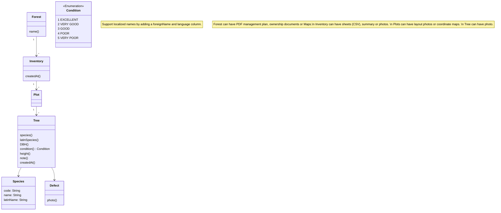
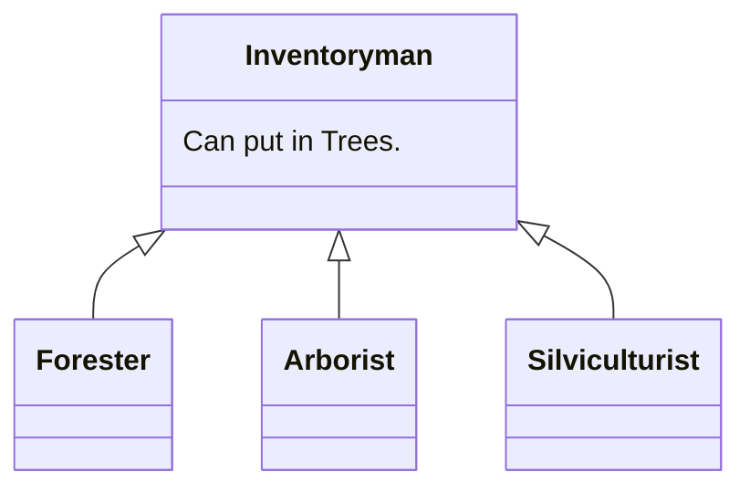

```mermaid
classDiagram
    
    Forest "1"-->"*" Inventory
    Inventory "1"-->"*" Plot
    Plot "1"-->"*" Tree
    Tree --> Species
    Tree --> Defect
    
    class Inventory {
        createdAt()
    }
    
    class Forest {
        name()
    }
    
    class Tree {
        species()
        latinSpecies()
        DBH()
        condition() Condition
        height()
        note()
        createdAt()
    }
    
    class Condition {
        <<Enumeration>>
        1 EXCELLENT 
        2 VERY GOOD
        3 GOOD
        4 POOR
        5 VERY POOR
    }
    
%%    note "You can give someone a task to fix up a tree"
%%    class Task {
%%        
%%    }
    
    class Plot {
        
    }
    
    note "Support localized names by adding a foreignName and language column. "
    class Species {
        code: String
        name: String
        latinName: String 
    }
    
    class Defect {
        photo()
    }
        
    note "Forest can have PDF management plan, ownership documents or Maps.\n Inventory can have sheets (CSV), summary or photos. \n Plots can have layout photos or coordinate maps. \n Tree can have photo."
```

```mermaid
classDiagram
Inventoryman <|-- Forester
Inventoryman <|-- Arborist
Inventoryman <|-- Silviculturist

class Inventoryman {
    Can put in Trees.
}
```