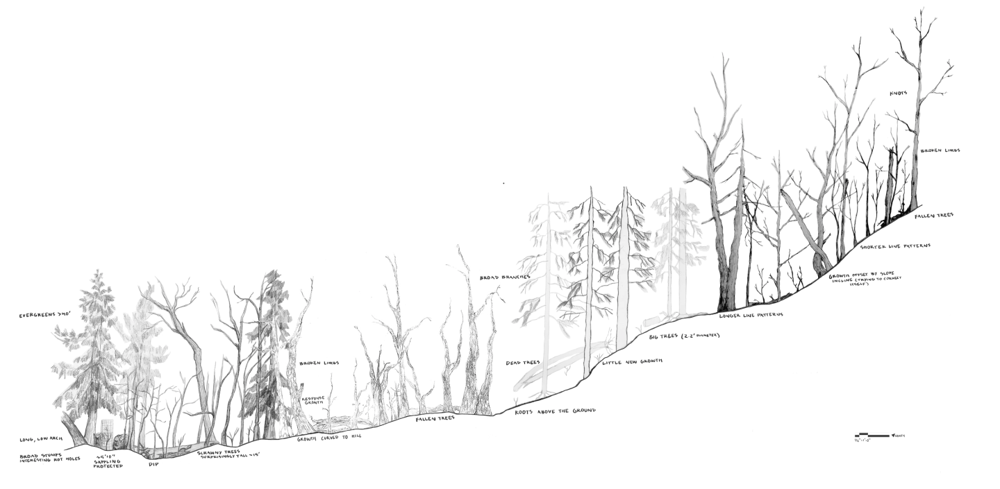
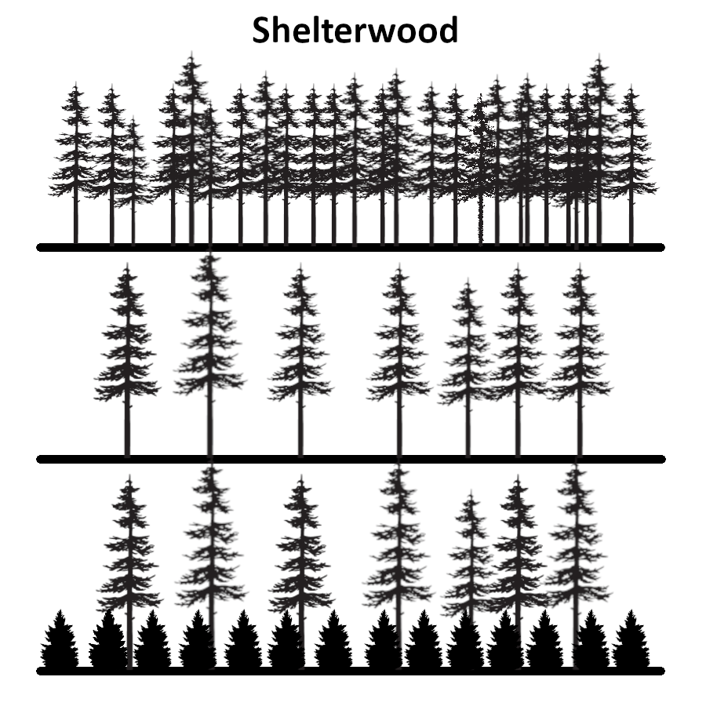

# Roles

- Forester: A trained professional who plans, implements, and monitors forest management activities (inventory, silviculture, harvest, roads, compliance).

- Silviculturist: A forester specializing in the science and practice of establishing, tending, and regenerating forest stands to meet objectives.

- Timber cruiser: A practitioner who measures sample plots to estimate timber volume, species composition, and value for a stand or sale.

- Logging contractor (Logger): A business or crew that performs felling, processing, skidding/forwarding, and loading logs according to a sale contract.

- Harvest manager: The person coordinating harvest layout, system choice, crew scheduling, and compliance with environmental and safety requirements.

- Sawmill operator/owner: Runs a mill that purchases logs and manufactures lumber or other wood products; often influences preferred log sizes/species and scaling rules.

- Woodland landowner: An individual or family that owns private forestland and makes decisions on stewardship, income, and conservation.

- Urban forester: A professional managing trees in cities for safety, shade, equity, stormwater, and resilience.

- Wildland firefighter (e.g., Incident Commander, Burn Boss): Personnel who plan and implement prescribed burns and respond to wildfires, documenting lessons learned.

- Forest health specialist (Entomologist/Pathologist): Diagnoses and manages insect and disease issues, and plans treatments including sanitation and salvage.

- Hydrologist: Advises on water quality, stream protection, and road/stream crossing design; helps ensure BMP compliance.

- Extension agent (Forestry): Educator providing research‑based guidance to landowners and practitioners via workshops, publications, and site visits.

- Certification auditor: Third‑party professional who evaluates management against standards (e.g., FSC, SFI) and chain‑of‑custody requirements.

# Terms

- Forest inventory: The systematic measurement of forest conditions (trees, growth, biomass, and attributes) for management and reporting. When taking forest inventory the following are important things to measure and note: species, diameter at breast height (DBH), height, site quality, age, and defects.

- Cruise (Timber cruise): A sampling campaign that estimates stand volume/value using plots or transects according to a designed protocol. "Inventorying" a forest.

- Plot: A fixed or variable‑radius area where tree measurements (e.g., DBH, height) are collected for inventory. Used to estimate the characteristics of an entire forest without having to measure every single tree.

- DBH (Diameter at Breast Height): Standard diameter of a tree measured at 1.3–1.4 m (4.5 ft) above ground, used in inventory and growth models.

- Basal area (BA): The sum of the cross‑sectional area of all trees at DBH per unit area (e.g., square feet per acre), indicating stand density. Measured in m^2/`acre or m^2/hectare.

- Stand: A contiguous group of trees relatively uniform in species, age, and site, managed as a unit.

- Site index: A measure of site productivity based on dominant/co‑dominant tree height at a reference age.

- Growth and yield: Forecasts of stand development (e.g., volume over time) under specified management regimes.

- Silviculture: The art and science of controlling forest establishment, composition, structure, and growth to meet objectives.

- Regeneration: Establishing a new cohort of trees naturally (seed/sprouts) or artificially (planting after site preparation).

- Shelterwood: An even‑aged regeneration method removing the stand in a series of cuts while leaving overstory trees to provide seed and shelter to seedlings.

- Seed‑tree: Even‑aged regeneration method that leaves widely spaced seed trees to naturally regenerate the stand, followed by removal.

- Selection system: Uneven‑aged silviculture, removing individual trees or small groups to create/maintain multiple age classes.

- Clearcut: Final harvest removing most or all trees in a stand to create even‑aged conditions; often paired with reforestation.

- Thinning (precommercial/commercial): The intermediate removal of trees to reduce competition and improve growth, vigor, or product value.

- Site preparation: Treatments (mechanical, burning, herbicide) that prepare a site for regeneration by controlling competing vegetation and managing slash.

- Stocking/survival surveys: Post‑planting assessments of trees per area and survival rates to verify regeneration success.

- Harvesting systems (ground‑based, cable, cut‑to‑length/CTL): Mechanized methods for felling, processing, and moving logs chosen to match terrain, soils, and objectives.

- Skid trail: A designated path where machines move logs to minimize soil disturbance by concentrating traffic.

- Landing: A work area where logs are decked and loaded onto trucks.

- Best Management Practices (BMPs): Practices that protect water, soil, and habitat during forestry operations (e.g., buffers, crossings, road drainage).

- Riparian buffer: A protected strip of vegetation along streams/lakes designed to maintain shade, bank stability, and water quality.

- Stream crossing: A designed crossing (culvert, ford, bridge) for equipment/roads that maintains hydrologic function and fish passage.

- Road building and decommissioning: Planning, constructing, maintaining, and retiring forest roads to meet operational needs and environmental standards.

- Slash: Residual woody material after harvest or thinning; may be piled, chipped, burned, or used to reduce soil disturbance.

- Fuels reduction: Treatments that lower wildfire intensity/likelihood (thinning, pruning, piling/burning, mastication).

- Prescribed burn (Rx fire): A planned, controlled fire under specific conditions to meet ecological or hazard‑reduction objectives.

- Firebreak (control line): A gap in vegetation or mineral soil line used to stop or steer fire spread.

- Salvage logging: Harvesting dead/dying trees after disturbance (insects, disease, wind, fire) to recover value and reduce hazards.

- Forest health threats (e.g., bark beetles, EAB): Biotic agents that damage trees; management may include sanitation, biological control, or chemical treatments.

- Remote sensing: Use of satellite, aerial, or LiDAR data to map forest cover, change, and structure.

- GIS (Geographic Information Systems): Tools for mapping and analyzing spatial data, including stands, roads, and sensitive areas.

- Deforestation vs. degradation: Deforestation is the conversion of forest to non‑forest; degradation is the reduction of forest quality/biomass without full conversion.

- Reforestation and afforestation: Reforestation re‑establishes forest on recently forested land; afforestation establishes forest on land long without trees.

- Urban tree canopy (UTC): The layer of leaves/branches that cover the ground in urban areas, tracked for shade, equity, and stormwater benefits.

- Stumpage: The price paid for standing timber on the stump, often determined by species, quality, volume, and market conditions.

- Log scaling (Doyle, Scribner, International 1/4): Systems that estimate board‑foot volume from log dimensions; regional preferences affect value.

- Board foot (BF, MBF, FBM): Units of lumber volume; 1 BF = volume of a board 1 in x 12 in x 12 in; 1 MBF = 1,000 board feet.

- Timber sale contract: A legal agreement defining volumes, payment terms, BMPs, responsibilities, and timelines for a timber harvest.

- Certification (e.g., FSC, SFI) and chain of custody: Standards and audits ensuring forests are managed sustainably and products are traced through the supply chain.

- Ecosystem services: Benefits people obtain from forests (carbon storage, water regulation, habitat, recreation).

- Carbon sequestration and credits (incl. REDD+): The capture and storage of atmospheric carbon in biomass/soils; credits monetize verified emission reductions or removals.

# Domain Model

## Sources
1. https://www.reddit.com/r/forestry/ — Practitioner Q&A, field photos, equipment and silviculture discussions.
2. https://forestryforum.com/board/ — The Forestry Forum; long‑running threads by loggers, sawyers, woodland owners, and foresters.
3. https://www.arboristsite.com/forums/forestry-logging-forum.9/ — Forestry & Logging subforum; operations, gear, and market talk.
4. https://www.fs.usda.gov/managing-land/forest-management — USDA Forest Service forest management portal with project pages and guidance.
5. https://www.fia.fs.usda.gov/ — Forest Inventory & Analysis (FIA) program; methods, datasets, and reports used in real inventories.
6. https://www.globalforestwatch.org/ — Global Forest Watch; interactive maps, alerts, and case‑based blog posts on forest change.
7. https://forestsnews.cifor.org/ — CIFOR Forests News; research‑backed stories, interviews, and case studies from around the world.
8. https://www.fao.org/forestry/en/ — FAO Forestry; community forestry, restoration, and policy case studies and manuals.
9. https://extension.oregonstate.edu/forestry — Oregon State University Extension Forestry; practical guides and local case examples.
10. https://forestry.ces.ncsu.edu/ — NC State Extension Forestry; landowner resources, management examples, and trainings.
11. https://www.bcfpb.ca/ — BC Forest Practices Board; independent investigations and audits of real forestry operations.
12. https://www.wildfirelessons.net/ — Wildland Fire Lessons Learned Center; incident reviews and practitioner discussions.
13. https://www.fire.ca.gov/what-we-do/natural-resource-management/forest-health — CAL FIRE Forest Health Program; funded project summaries and outcomes.
14. https://eforester.org/ — Society of American Foresters; news, policy updates, and professional learning opportunities.
15. https://www.americanforests.org/ — American Forests; urban and rural forestry project profiles, toolkits, and case stories.

## Images
- Transect: 
- Shelterwood: 