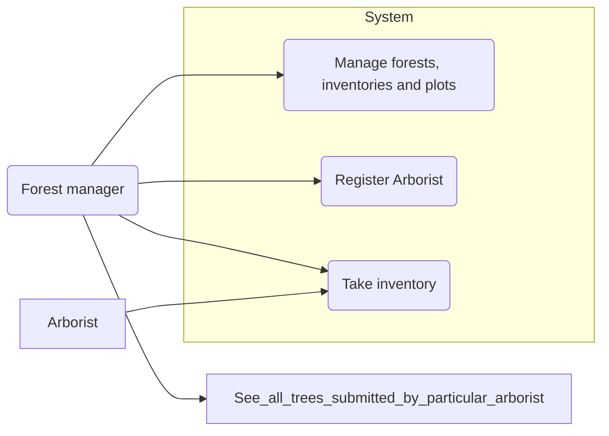

# Roles

```mermaid
graph LR

Forest_manager(Forest manager)

subgraph System 
    Manage_forests(Manage forests, inventories and plots)
    Register_arborist(Register Arborist)
    Take_inventory(Take inventory)
end

Forest_manager --> Register_arborist
Forest_manager --> Take_inventory
Forest_manager --> Manage_forests
Forest_manager --> See_all_trees_submitted_by_particular_arborist

Arborist --> Take_inventory
```
# Use cases
- Take inventory 
  - Put in data about a Tree.
  - Optionally, a note can be attached.
  - Optionally, the Tree can be tied to a plot.
