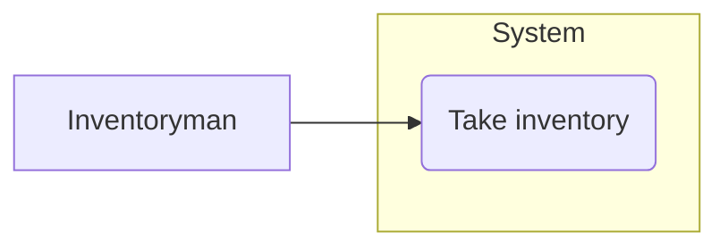

# Roles

```mermaid
graph LR

subgraph System 
    Take_inventory(Take inventory)
end

Inventoryman --> Take_inventory
```
# Use cases
- Take inventory
  - Forest must exist. 
  - Put in data about a Tree, into an existing Plot. 
- 